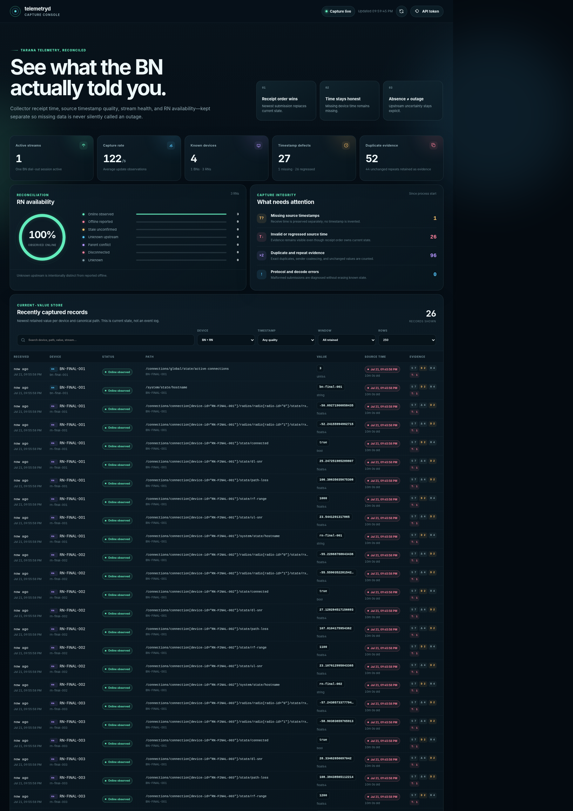

# telemetryd

`telemetryd` is a small, stateful gNMI dial-out receiver built for Tarana BN/RN telemetry. It replaces the `gnmic listen`/`gnmicc listen` process with a Go service that owns the data contract instead of immediately flattening an unreliable stream into a time-series database.

The current generation is deliberately **SNMP-like**:

- Every BN and RN has one in-memory record.
- Every canonical gNMI path has one latest value per device.
- A newer receipt overwrites the prior value, even when its device timestamp is missing or moves backward.
- The overwritten value is gone; counters and timestamps retain evidence about duplicates, repeats, value changes, and timestamp regressions.
- Inventory and last-known values do not disappear merely because a later message omitted them.

The service also keeps stream sessions, receive ordering, source timestamps, explicit deletes, atomic snapshot semantics, BN/RN parentage, and cautious availability states. It exposes a polished embedded capture console, JSON, Zabbix-oriented plain-text and discovery endpoints, Prometheus health metrics, and stable in-process table indices intended for a future SNMP agent.

Open the operator console at:

```text
http://127.0.0.1:8080/ui/
```



The console shows live capture status, timestamp and duplicate diagnostics, recent retained records, reconciled RN availability, and gRPC stream sessions. See [docs/DASHBOARD.md](docs/DASHBOARD.md) for authentication, filters, remote-access setup, and operator guidance.

## Why this exists

A dial-out gNMI stream is not automatically a sequence of complete device snapshots. Treating each submission—or a moving database window—as complete causes exactly the operational ambiguity this project is intended to eliminate:

- an unchanged hostname ages out and the RN appears to vanish;
- duplicate submissions create multiple apparent samples;
- an omitted RN is incorrectly declared down;
- collector receipt time is confused with device sample time;
- a BN transport failure is reported as dozens of child RN outages;
- a source timestamp regression silently replaces newer source data.

`telemetryd` preserves those distinctions instead of hiding them.

## Supported wire contract

The default RPC is:

```text
/Nokia.SROS.DialoutTelemetry/Publish
```

It is a bidirectional stream. The dial-out client sends standard `gnmi.SubscribeResponse` messages, and the listener sends one empty protobuf acknowledgement for every received message. That is the same wire shape used by the public gNMIc dial-out implementation used with Tarana.

The RPC method is configurable with repeatable `--grpc-method` flags. Additional methods must use the same request/ack shape. A genuinely different protobuf service needs another receiver implementation, while vendor path semantics belong in an `adapter.Adapter` implementation.

## Architecture

```text
Tarana BN
  │  bidi gRPC dial-out: SubscribeResponse / empty ack
  ▼
internal/dialout
  │  stream ID, peer, TLS identity, metadata, receive ordering
  ▼
internal/ingest
  │  normalized paths, typed values, source/receive timestamps
  ▼
internal/adapter/tarana
  │  BN identity, RN identity, hostname/MAC/state hints
  ▼
internal/state
  │  latest-value maps + reconciliation + session diagnostics
  ├──────────────► embedded Capture Console + HTTP/JSON
  ├──────────────► Zabbix discovery/value endpoints
  ├──────────────► Prometheus health/status metrics
  └──────────────► future BatchRecorder / persistence / SNMP table
```

The gRPC receiver does not decide whether an RN is down. The reconciler does not decode vendor protobufs. The API does not mutate telemetry state. These boundaries are intentional.

## Build

Go 1.22 or newer is required. The repository includes a dependency checksum file and CI workflow.

```bash
go mod download
make verify
```

`make verify` runs the unit/integration tests, `go vet`, the race detector, and builds static `bin/telemetryd` and `bin/telemetrysim` binaries. A faster development pass is:

```bash
make check build
```

## Run

A safe local-development invocation is:

```bash
export TELEMETRYD_TOKEN='replace-with-a-long-random-value'

./bin/telemetryd \
  --grpc-listen=:50051 \
  --http-listen=127.0.0.1:8080 \
  --http-token="$TELEMETRYD_TOKEN" \
  --bn-stale-after=3m \
  --rn-stale-after=5m
```

Then open:

```text
http://127.0.0.1:8080/ui/
```

To make the console reachable from another workstation, use `--http-listen=0.0.0.0:8080`, keep the bearer token enabled, and browse to `http://<collector-ip>:8080/ui/`. The static dashboard shell can load without credentials; all telemetry APIs remain token-protected.

Configure the Tarana telemetry destination to the collector address and gRPC port. If the deployment requires destination port 80, either:

```bash
sudo setcap cap_net_bind_service=+ep ./telemetryd
./bin/telemetryd --grpc-listen=:80
```

or map host port 80 to container port 50051. Do not run the whole service as root solely to bind a low port.

### TLS and mTLS

```bash
./telemetryd \
  --grpc-listen=:50051 \
  --grpc-tls-cert=/etc/telemetryd/server.crt \
  --grpc-tls-key=/etc/telemetryd/server.key \
  --grpc-client-ca=/etc/telemetryd/client-ca.crt \
  --grpc-require-client-cert
```

Without `--grpc-require-client-cert`, a configured client CA verifies a client certificate when one is presented but does not require it.

The HTTP API defaults to loopback. When binding it to a routable address, set `--http-token` and enforce network policy as well.

## Simulator

The included simulator speaks the same RPC shape and generates one BN with multiple RNs:

```bash
./bin/telemetrysim \
  --server=127.0.0.1:50051 \
  --bn=BN-DEMO-001 \
  --rns=RN-DEMO-001,RN-DEMO-002 \
  --interval=5s
```

Fault injection:

```bash
./bin/telemetrysim \
  --missing-timestamp-every=3 \
  --regress-timestamp-every=5 \
  --duplicate-every=2
```

Then inspect the live console:

```text
http://127.0.0.1:8080/ui/
```

Or query the newest retained current values directly:

```bash
curl -H "Authorization: Bearer $TELEMETRYD_TOKEN" \
  'http://127.0.0.1:8080/v1/recent?limit=100'
```

## State and overwrite semantics

The latest-value key is:

```text
device kind + stable device ID + canonical gNMI path including all list keys
```

For example, these are different values:

```text
/connections/connection[device-id="RN-1"]/radios/radio[radio-id="0"]/state/rx-signal-level/avg
/connections/connection[device-id="RN-1"]/radios/radio[radio-id="1"]/state/rx-signal-level/avg
```

A later **collector receipt** overwrites an earlier one. Source timestamp is evidence, not the overwrite arbiter. This choice directly implements the requested SNMP-style “current value” model and prevents a late or regressed source clock from making the collector ignore what it actually received.

Each retained metric includes:

- `received_at`: collector wall-clock time;
- `source_timestamp` and raw nanoseconds, when supplied;
- `timestamp_quality`: `source`, `missing`, `invalid_past`, `future`, or `regressed`;
- stream ID, logical subscription scope, per-stream message sequence, and process-wide observation order;
- first-seen, last-received, and last-value-change times;
- sample, exact-duplicate, repeated-value, value-change, source-regression, and sender-reported duplicate counters.

Collector-wide sender-reported duplicate totals are also exposed through `/v1/overview`, `/zabbix/collector?field=reported_duplicates`, and `/metrics`.

The process clock should be synchronized. Receive time cannot reconstruct the real device sample time, but it gives every observation an auditable local ordering when source time is absent.

## Reconciled availability

`telemetryd` does not convert absence into a definitive outage. It exposes these states:

| State | Code | Meaning |
|---|---:|---|
| `offline_reported` | 0 | An explicit offline/down state or RN connection delete was received. |
| `disconnected` | 0 | A BN has no active dial-out stream. |
| `online_observed` | 1 | Fresh evidence exists and the parent BN is healthy. |
| `stale_unconfirmed` | 2 | Parent BN is healthy, but this device has exceeded its freshness threshold. |
| `unknown_upstream` | 3 | RN state cannot be determined because its parent BN is disconnected, stale, or unknown. |
| `conflict` | 4 | Multiple healthy BNs recently claimed the same RN. |
| `unknown` | 5 | No stronger classification is available. |

Important behavior:

- A non-atomic message that omits an RN does nothing to that RN’s cached values.
- A standard gNMI `delete` removes the matching subtree. Deleting the keyed RN connection root records `offline_reported`.
- An `atomic=true` notification is treated as a complete replacement only under its own prefix and logical subscription scope. The scope uses `gRPC method + subscription-name` when the BN supplies that metadata, so ownership survives reconnects; otherwise it falls back conservatively to the current stream ID.
- Even an atomic omission does **not** mean RN offline by default. `--atomic-omission-means-offline` is available only for deployments that have verified that Tarana’s atomic payload is a complete authoritative RN set.
- When a BN stream fails, child RNs become `unknown_upstream`, not offline.
- `/connections/global/state/active-connections` is retained as an independent consistency check. The API exposes the difference between that reported count and the count of freshly observed child RNs.

Tune freshness thresholds to the configured telemetry cadence, not to an arbitrary polling interval.

## Tarana identity and paths

BN identity preference is:

1. gNMI prefix target;
2. incoming metadata such as `system-name` or `device-id`;
3. an already resolved identity on the stream;
4. peer IP address.

When a higher-quality identity appears later, the temporary BN record is merged into it.

RN identity is extracted from the keyed `connections/connection` list, accepting common key spellings such as `device-id` and `connection_device-id`.

Known Tarana hints include:

```text
BN hostname:              /system/state/hostname
BN active RN count:       /connections/global/state/active-connections
BN radio signal:          /radios/radio/state/rx-signal-level/avg
RN hostname:              /connections/connection/system/state/hostname
RN MAC:                   /connections/connection/platform/state/mac-address
RN DL/UL SNR:             /connections/connection/state/dl-snr
                           /connections/connection/state/ul-snr
RN path loss/range:       /connections/connection/state/path-loss
                           /connections/connection/state/rf-range
RN radio signal:          /connections/connection/radios/radio/state/rx-signal-level/avg
```

All other standard typed gNMI values are retained generically even when no Tarana-specific hint exists.

## HTTP API

Health endpoints do not require the configured token:

```text
GET /healthz
GET /readyz
```

Operator console and core JSON endpoints:

```text
GET /ui/
GET /v1/overview
GET /v1/summary
GET /v1/recent?limit=200&kind=rn&since=10m&q=snr
GET /v1/attention/rns?limit=40
GET /v1/snapshot?metrics=true
GET /v1/bns?metrics=false&status=online_observed&q=site-a&limit=250&offset=0
GET /v1/bns/{id}?metrics=true
GET /v1/rns?metrics=false&bn={BN-ID}&status=stale_unconfirmed&q=roof&limit=250&offset=0
GET /v1/rns/{id}?metrics=true
GET /v1/streams
GET /v1/lookup?kind=rn&id={RN-ID}&path={PATH}
GET /v1/schema
GET /metrics
```

`/v1/recent` is a newest-first view over the retained current-value map, not an event history. It returns each device/path at most once and supports `limit`, `kind`, `id`, `bn`, `path`, `q`, `quality`, `status`, `since`, and `since_seconds`. Its response reports how many paths were scanned, matched, returned, and truncated.

`/v1/attention/rns` returns a bounded, diagnostic-priority RN view suitable for polling a large fleet without materializing a full snapshot. `/v1/bns` and `/v1/rns` support case-insensitive `q` search plus optional `limit` (maximum 5000) and `offset`; omitting `limit` preserves the original all-items response behavior.

Authentication may use either header:

```text
Authorization: Bearer <token>
X-Telemetry-Token: <token>
```

### Direct metric lookup

An exact canonical path always works:

```bash
curl --get \
  -H "Authorization: Bearer $TELEMETRYD_TOKEN" \
  --data-urlencode 'kind=rn' \
  --data-urlencode 'id=RN-DEMO-001' \
  --data-urlencode 'path=/connections/connection[device-id="RN-DEMO-001"]/state/dl-snr' \
  http://127.0.0.1:8080/v1/lookup
```

A key-free base path works only when it is unambiguous. Per-radio paths can be selected without constructing a canonical path:

```bash
curl --get \
  -H "Authorization: Bearer $TELEMETRYD_TOKEN" \
  --data-urlencode 'kind=rn' \
  --data-urlencode 'id=RN-DEMO-001' \
  --data-urlencode 'path=/connections/connection/radios/radio/state/rx-signal-level/avg' \
  --data-urlencode 'key.radio_id=1' \
  http://127.0.0.1:8080/v1/lookup
```

Selector punctuation is normalized, so `key.radio-id`, `key.radio_id`, and `key.radioId` match the same path key.

## Zabbix

Zabbix-oriented endpoints are:

```text
GET /zabbix/collector?field=rn_count
GET /zabbix/discovery/bns
GET /zabbix/discovery/rns?bn={BN-ID}
GET /zabbix/value?kind=rn&id={RN-ID}&field=status_code
GET /zabbix/value?kind=rn&id={RN-ID}&path={PATH}&attribute=value_text
```

They return plain scalar text for collector/device/metric values and low-level-discovery JSON for inventory. The metric endpoint supports `key.<name>=<value>` selectors for keyed list paths. `/zabbix/collector` exposes cheap process-wide counters without walking every device.

See [docs/ZABBIX.md](docs/ZABBIX.md) for item prototypes, fields, trigger guidance, and the distinction between “known offline” and “unknown upstream.”

## Prometheus

`/metrics` contains collector health and reconciled BN/RN status, not every arbitrary telemetry path. It intentionally includes device labels and may therefore be high-cardinality in a large RN deployment. Zabbix direct lookup or a future purpose-built exporter is preferable when that cardinality is undesirable.

## Resource controls

Defaults:

```text
maximum BNs:                10,000
maximum RNs:                1,000,000
maximum metrics/device:     20,000
maximum retained sessions:  4,096 closed/active diagnostic records
maximum gRPC message:       32 MiB
maximum streams/connection: 1,024
```

When a device exceeds the per-device metric limit, the least-recently received path is evicted. BN/RN capacity exhaustion rejects new identities and increments diagnostics rather than allowing unbounded growth.

## Persistence and SNMP extension points

The in-memory `state.Store` is the source of current truth in this generation. A process restart intentionally loses state.

`internal/ingest.BatchRecorder` is a normalized, immutable batch sink. A future write-ahead log, Kafka/NATS publisher, or database writer can be attached without changing the gRPC receiver or reconciler. For durable recovery, persist both normalized observations and the device/index inventory.

Every BN and RN is assigned a positive 31-bit `snmp_index`. It is deterministic from kind and device ID unless an in-process hash collision requires probing. Persistence must save the final index allocation before those indices can be promised stable across every restart and collision scenario.

See [docs/PERSISTENCE_AND_SNMP.md](docs/PERSISTENCE_AND_SNMP.md).

## Operational caveats

- This program can distinguish **reported offline**, **stale while parent is healthy**, and **unknown because the BN path failed**. It cannot prove physical reality from a single imperfect source.
- A missing source timestamp remains missing; receive time is never relabeled as device time.
- A source timestamp marked `future`, `invalid_past`, or `regressed` is preserved for diagnosis.
- `proto_bytes` values are retained as base64. Decoding vendor-native protobuf payloads requires their descriptor and a decoder extension.
- gRPC reflection is off by default because the listener registers configurable stream methods without a generated vendor service descriptor. Health reflection is not required for operation; use the included simulator or the documented proto when testing.
- The current adapter recognizes Tarana semantics. The transport and typed-value normalization are reusable, but another vendor will need an adapter and possibly another wire receiver.

## Project layout

```text
cmd/telemetryd/             service entry point
cmd/telemetrysim/           fault-injecting dial-out simulator
internal/dialout/           generic SubscribeResponse/empty-ack gRPC receiver
internal/ingest/            normalization and future recorder seam
internal/adapter/tarana/     Tarana identity/path semantics
internal/state/             latest-value store, reconciliation, and bounded operator views
internal/httpapi/           embedded dashboard, JSON, Zabbix, and Prometheus surfaces
proto/                      documentation-only wire contract
settings via CLI flags       no runtime config dependency
```

See [docs/DASHBOARD.md](docs/DASHBOARD.md) for the capture console, [docs/ARCHITECTURE.md](docs/ARCHITECTURE.md) for invariants and extension guidance, and [VALIDATION.md](VALIDATION.md) for what was verified in the supplied artifact.
